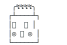

<picture>
  <source media="(prefers-color-scheme: dark)" srcset="./wetwire-dark.svg">
  
</picture>

Practical guidance for teams adopting wetwire-observability alongside existing monitoring infrastructure.

---

## Migration Strategies

### Side-by-Side Adoption

You don't need to migrate everything at once. wetwire-observability generates standard configuration files that work with the same tools you already use.

**Coexistence patterns:**

| Existing Setup | Integration Approach |
|----------------|---------------------|
| Raw YAML configs | Keep existing files; add new configs in Go |
| Prometheus Operator | Use `--mode=operator` for new resources |
| Grafana provisioning | wetwire generates compatible JSON |
| Helm charts | Override values with generated configs |

### Incremental Migration Path

**Week 1: Proof of concept**
- Pick a small, isolated config (new scrape target, simple dashboard)
- Write it in wetwire-observability
- Verify the generated output
- Deploy to a test environment

**Week 2-4: Build confidence**
- Convert 2-3 more configs
- Establish team patterns (file organization, naming conventions)
- Set up CI/CD for config validation

**Ongoing: New configs in Go**
- All new monitoring configs use wetwire-observability
- Migrate legacy configs opportunistically

### What NOT to Migrate

Some configs are better left alone:
- **Stable production configs** that never change
- **Vendor-provided dashboards** (Grafana marketplace)
- **Auto-generated configs** from service discovery
- **Configs managed by operators** with their own CRDs

Migration should reduce maintenance burden, not create it.

---

## Escape Hatches

When you hit an edge case the library doesn't handle cleanly.

### Complex PromQL Expressions

For histogram quantiles and other complex expressions, use the typed builders:

```go
// histogram_quantile(0.99, sum by (le, service) (rate(http_request_duration_seconds_bucket[5m])))
var ComplexExpr = promql.Histogram_quantile(0.99,
    promql.Sum(promql.Rate(
        promql.Vector("http_request_duration_seconds_bucket"),
        "5m",
    ), "le", "service"),
)
```

### Custom Grafana Panel Options

For plugin-specific options not covered by typed panels:

```go
var CustomPanel = grafana.Panel{
    Type: "custom-plugin",
    Options: map[string]any{
        "pluginSpecific": "value",
    },
}
```

### Generated Output Post-Processing

For configs the library doesn't yet support, generate what you can and merge with hand-written YAML:

```bash
# Generate typed configs
wetwire-obs build . -o ./generated/

# Merge with hand-written additions
cat ./generated/prometheus.yml ./extras/prometheus-additions.yml > ./final/prometheus.yml
```

### When to File an Issue

If you're using escape hatches for:
- Common Prometheus/Alertmanager options
- Standard Grafana panel types
- Patterns other teams would need

...file an issue. The library should handle it.

---

## Team Onboarding

A playbook for getting your team productive in the first week.

### Day 1: Environment Setup

```bash
# Clone your monitoring repo
git clone <repo>
cd <repo>

# Install wetwire-obs CLI
go install github.com/lex00/wetwire-observability-go/cmd/wetwire-obs@latest

# Verify it works
wetwire-obs list ./monitoring/... && echo "OK"
```

**What to check:**
- Go 1.23+ installed
- wetwire-obs CLI available in PATH
- Access to test Prometheus/Grafana instances

### Day 1-2: Read the Code

Start with a simple config file:

```go
package monitoring

import (
    "time"
    "github.com/lex00/wetwire-observability-go/prometheus"
    "github.com/lex00/wetwire-observability-go/rules"
)

var APIScrape = prometheus.ScrapeConfig{
    JobName:        "api",
    ScrapeInterval: 15 * time.Second,
    StaticConfigs: []prometheus.StaticConfig{
        {Targets: []string{"api:8080"}},
    },
}
```

That's the pattern. Every config file looks like this.

### Day 2-3: Make a Small Change

Find something low-risk:
- Add a new scrape target
- Add a label to an existing config
- Create a simple recording rule

```go
// Before
var APIScrape = prometheus.ScrapeConfig{
    JobName: "api",
}

// After
var APIScrape = prometheus.ScrapeConfig{
    JobName: "api",
    Labels: map[string]string{
        "team": "platform",
    },
}
```

Run it, diff the output, deploy to dev.

### Day 3-4: Add a New Alert

Create a new alert using typed expressions:

```go
package monitoring

import (
    "time"
    "github.com/lex00/wetwire-observability-go/rules"
    "github.com/lex00/wetwire-observability-go/promql"
)

var HighLatency = rules.AlertingRule{
    Alert: "HighAPILatency",
    Expr: promql.GT(
        promql.Histogram_quantile(0.99,
            promql.Sum(promql.Rate(
                promql.Vector("http_request_duration_seconds_bucket"),
                "5m",
            ), "le"),
        ),
        promql.Scalar(0.5),
    ),
    For:      5 * time.Minute,
    Severity: rules.Warning,
    Annotations: map[string]string{
        "summary": "API latency is high",
    },
}
```

### Day 5: Review the Patterns

By now you've seen:
- Struct literals for configs
- Typed PromQL expression builders
- Package-level var declarations
- Shared expressions across alerts and dashboards

That's 90% of what you need.

### Common Gotchas

| Problem | Solution |
|---------|----------|
| "undefined: prometheus" | Add import for the package |
| "Resource not in output" | Ensure it's a package-level var declaration |
| PromQL syntax error | Use typed builders, not raw strings |
| Dashboard panels overlap | Use Row-based layout |

### Team Conventions to Establish

Decide these early:
- **File organization**: By service (api.go) or by type (scrapes.go, alerts.go)?
- **Naming**: Match Go variable names to job_name/alert name?
- **Shared expressions**: Where to put reusable PromQL expressions?
- **Output mode**: Standalone or Operator?

Document in your repo's README.

---

## Resources

- [Quick Start](QUICK_START.md) - 5-minute intro
- [CLI Reference](CLI.md) - Build and lint commands
- [Lint Rules](LINT_RULES.md) - All WOB rules

---

## See Also

- [FAQ](FAQ.md) - Common questions and answers
